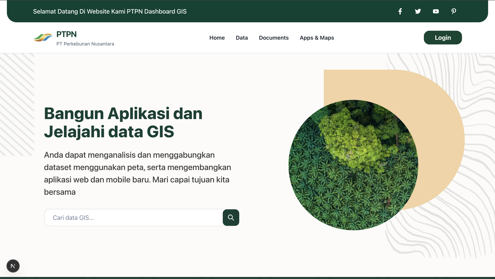

# 🌍 GIS Landing Page for PTPN

This is a **Geographic Information System (GIS)** landing page developed for **PTPN** using the latest [Next.js 15](https://nextjs.org) framework combined with the powerful and accessible [Chakra UI](https://chakra-ui.com) component library.



## 🚀 Overview

The landing page serves as the main entry point to the GIS platform for PTPN, offering clean UI, intuitive navigation, and fast performance. Built with modern web technologies, it ensures maintainability, scalability, and excellent developer experience.

## 🛠️ Tech Stack

- **Next.js 15** – App Router architecture with powerful SSR & file-based routing.
- **Chakra UI** – Simple, modular and accessible component library for React.
- **TypeScript** – Strongly typed language for safer and smarter development.
- **Geist Font** – Beautiful and performant font family by Vercel, optimized via `next/font`.

## 📂 Project Structure

- `app/page.tsx` – Main landing page file.
- `public/static/home.png` – Hero/landing preview image.
- `components/` – Modular Chakra UI-based UI components.
- `libs/` – Utility functions and shared logic.
- `styles/` – Global and scoped styles (if any).

## 💻 Getting Started

To start developing locally, follow these steps:

```bash
# Install dependencies
npm install

# Start the development server
npm run dev
# or
yarn dev
# or
pnpm dev
# or
bun dev
